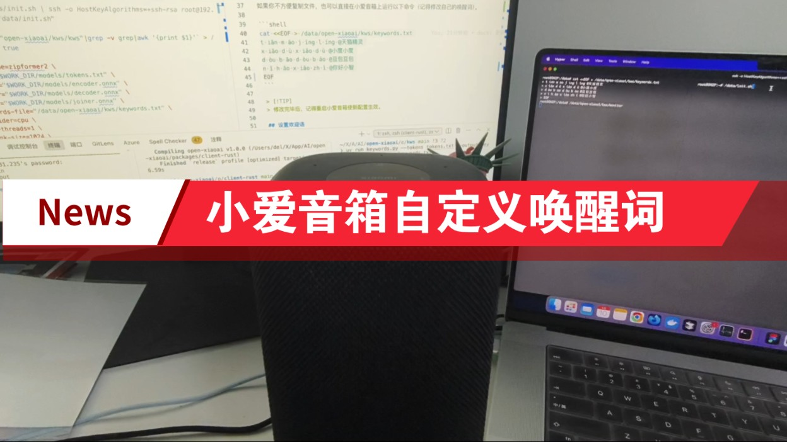

# Open-XiaoAI

让小爱音箱「听见你的声音」，解锁无限可能。

## 简介

2017 年，当全球首款千万级销量的智能音箱诞生时，我们以为触摸到了未来。但很快发现，这些设备被困在「指令-响应」的牢笼里：

- 它听得见分贝，却听不懂情感
- 它能执行命令，却不会主动思考
- 它有千万用户，却只有一套思维

我们曾幻想中的"贾维斯"级人工智能，在现实场景中沦为"天气预报+音乐播放器"。

**真正的智能不应被预设的代码逻辑所束缚，而应像生命体般在交互中进化。**

在上一个 [MiGPT](https://github.com/idootop/mi-gpt) 项目中，我们已经实现将 ChatGPT 接入到小爱音箱。

这一次 [Open-XiaoAI](https://github.com/idootop/open-xiaoai) 再次进化，直接接管小爱音箱的“耳朵”和“嘴巴”，

通过多模态大模型和 AI Agent，将小爱音箱的潜力完全释放，解锁无限可能。

**未来由你定义!**

## 你的声音 + 小爱音箱 = 无限可能

👉 [小爱音箱接入小智 AI 演示视频](https://www.bilibili.com/video/BV1NBXWYSEvX)

👉 [小爱音箱自定义唤醒词演示视频](https://www.bilibili.com/video/BV1YfVUz5EMj)

👉 [小爱音箱接入 MiGPT 演示视频](https://www.bilibili.com/video/BV1N1421y7qn)

## 快速开始

> [!IMPORTANT]
> 本教程仅适用于 **小爱音箱 Pro（LX06）** 和 **Xiaomi 智能音箱 Pro（OH2P）** 这两款机型，**其他型号**的小爱音箱请勿直接使用！🚨

本项目由 Client 端 + Server 端两部分组成，你可以按照以下顺序运行该项目：

1. 刷机更新小爱音箱补丁固件，开启并 SSH 连接到小爱音箱 👉 [教程](docs/flash.md)
2. 在小爱音箱上安装运行 Client 端补丁程序 👉 [教程](packages/client-rust/README.md)
3. 运行以下演示程序，体验小爱音箱的全新能力 ✨
   - 👉 [小爱音箱接入小智 AI](examples/xiaozhi/README.md)
   - 👉 [小爱音箱自定义唤醒词](examples/kws/README.md)
   - 👉 [小爱音箱接入 MiGPT（完美版）](examples/migpt/README.md)
   - 👉 [小爱音箱接入 Gemini Live API](examples/gemini/README.md)

以上皆为抛砖引玉，你也可以亲手编写自己想要的功能，一切由你定义！

## 相关项目

> [!TIP]
> 技术的意义在于分享与共创。如果你打算或正在使用本项目做些有趣的事情，
> 欢迎提交 PR 或 issue 分享你的项目和创意。✨

如果你不想刷机，或者不是小爱音箱 Pro，下面的项目或许对你有用：

- https://github.com/idootop/mi-gpt
- https://github.com/idootop/migpt-next
- https://github.com/yihong0618/xiaogpt
- https://github.com/hanxi/xiaomusic

## 参考链接

如果你想要了解更多技术细节，下面的链接可能对你有用：

- https://github.com/yihong0618/gitblog/issues/258
- https://github.com/jialeicui/open-lx01
- https://github.com/duhow/xiaoai-patch
- https://javabin.cn/2021/xiaoai_fm.html
- https://xuanxuanblingbling.github.io/iot/2022/09/16/mi/

## 免责声明

1. **适用范围**
   本项目为开源非营利项目，仅供学术研究或个人测试用途。严禁用于商业服务、网络攻击、数据窃取、系统破坏等违反《网络安全法》及使用者所在地司法管辖区的法律规定的场景。
2. **非官方声明**
   本项目由第三方开发者独立开发，与小米集团及其关联方（下称"权利方"）无任何隶属/合作关系，亦未获其官方授权/认可或技术支持。项目中涉及的商标、固件、云服务的所有权利归属小米集团。若权利方主张权益，使用者应立即主动停止使用并删除本项目。

继续下载或运行本项目，即表示您已完整阅读并同意[用户协议](agreement.md)，否则请立即终止使用并彻底删除本项目。

## License

[MIT](LICENSE) License © 2024-PRESENT Del Wang
