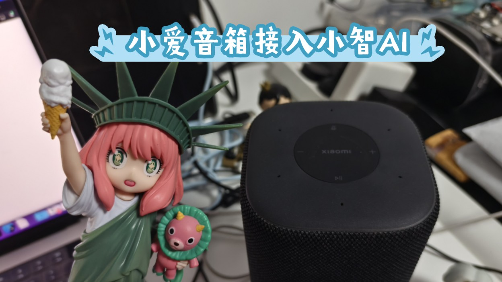

# Open-XiaoAI

让小爱音箱「听见你的声音」，解锁无限可能。

## 简介

2017 年，当全球首款千万级销量的智能音箱诞生时，我们以为触摸到了未来。但很快发现，这些设备被困在「指令-响应」的牢笼里：

- 它听得见分贝，却听不懂情感
- 它能执行命令，却不会主动思考
- 它有千万用户，却只有一套思维

我们曾幻想中的"贾维斯"级人工智能，在现实场景中沦为"闹钟+音乐播放器"。

**真正的智能不应被预设的代码逻辑所束缚，而应像生命体般在交互中进化。**

在上一个 [MiGPT](https://github.com/idootop/mi-gpt) 项目中，我们已经实现将 ChatGPT 接入到小爱音箱。

这一次 [Open-XiaoAI](https://github.com/idootop/open-xiaoai) 再次进化，直接接管小爱音箱的“耳朵”和“嘴巴”，

通过多模态大模型和 AI Agent，将小爱音箱的潜力完全释放，解锁无限可能。

**未来由你定义!**

## 你的声音 + 小爱音箱 = 无限可能

👉 [小爱音箱接入小智 AI 演示视频](https://www.bilibili.com/video/BV1NBXWYSEvX)

👉 [小爱音箱接入 MiGPT 演示视频](https://www.bilibili.com/video/BV1N1421y7qn)

## 刷机教程

> [!CAUTION]
> 刷机有风险，操作需谨慎。

整理中，敬请期待 :)

## 使用说明

本项目由 Client 端 + Server 端两部分组成，你可以按照以下顺序运行该项目：

1. 按照刷机教程更新小爱音箱固件，开启 SSH 并连接到小爱音箱（整理教程中……
2. 在你的电脑上编译好 Rust 补丁程序（Client 端），然后复制到小爱音箱上运行 👉 [教程](packages/client-rust/README.md)
3. 在你的电脑上运行 Server 端演示程序，体验小爱音箱的全新能力 ✨
   - Python Server 演示 👉 [小爱音箱接入小智 AI](packages/server-python/README.md)
   - Node.js Server 演示 👉 [小爱音箱接入 MiGPT-Next](packages/server-node/README.md)

以上皆为抛砖引玉，你也可以自己亲手编写想要的功能，一切由你定义！

> [!TIP]
> 技术的意义在于分享与共创。如果你打算或正在用本项目做些有趣的事情，
> 欢迎提交 PR 或 issue 分享你的项目和创意。✨

## 免责声明

1. **适用范围**
   本项目为非盈利开源项目，仅限于技术原理研究、安全漏洞验证及非营利性个人使用。严禁用于商业服务、网络攻击、数据窃取、系统破坏等违反《网络安全法》及使用者所在地司法管辖区的法律规定的场景。
2. **非官方声明**
   本项目由第三方开发者独立开发，与小米集团及其关联方（下称"权利方"）无任何隶属/合作关系，未获其官方授权/认可或技术支持。项目中涉及的商标、固件、云服务的所有权利归属小米集团。若权利方主张权益，使用者应立即主动停止使用并删除本项目。

继续下载或运行本项目，即表示您已完整阅读并同意[用户协议](agreement.md)，否则请立即终止使用并彻底删除本项目。

## License

[MIT](LICENSE) License © 2024-PRESENT Del Wang
