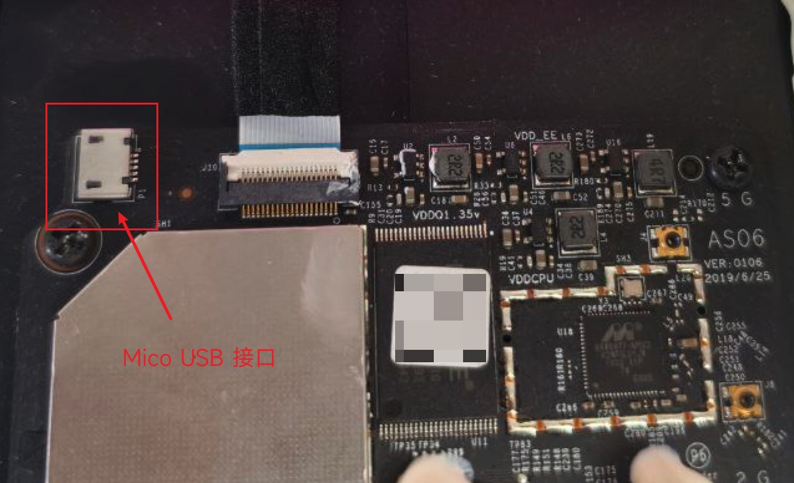
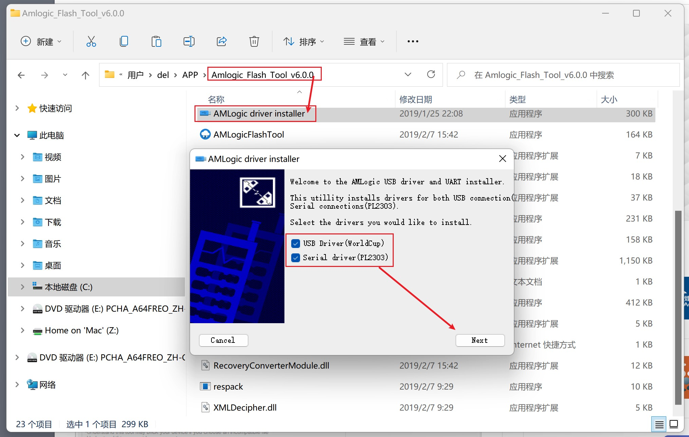
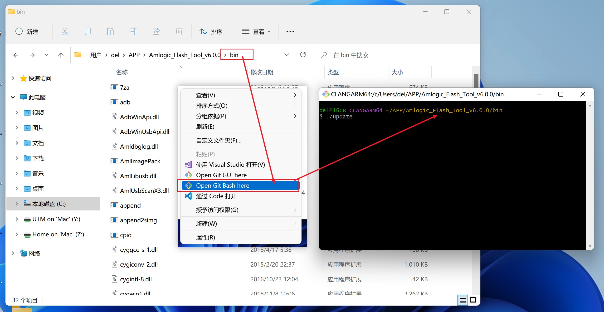

# 小爱音箱 Pro 刷机教程

> [!IMPORTANT]
> 本教程仅适用于 **小爱音箱 Pro（LX06）** 和 **Xiaomi 智能音箱 Pro（OH2P）** 这两款机型，**其他型号**的小爱音箱请勿直接使用！🚨

### 准备条件

- 小爱音箱
  - Xiaomi 智能音箱 Pro（OH2P）
  - 小爱音箱 Pro（LX06）
- 数据线
  - Type-C（适用于新款小爱音箱 Pro，**无需拆机**）
  - Micro USB（旧款小爱音箱 Pro 用这种，**需要拆机**）
  
> [!NOTE]
> 注意：数据线不能只是充电线，需要连接到电脑上能传输数据才行。

### 连接电脑

新款的 Xiaomi 智能音箱 Pro 可以直接使用 Type-C 数据线通过音响底部的 Type-C 接口连接到电脑。

旧款小爱音箱 Pro 需要先把音箱外壳拆下来（[参考步骤](https://www.52audio.com/archives/38303.html)），然后在主板左上角找到 Mico USB 的调试接口，使用 Mico USB 数据线连接到电脑。



### 开始刷机

> [!CAUTION]
> 刷机有风险，操作需谨慎。刷机可能会造成设备失去保修资格，变砖无法运行等。请自行评估相关风险，一切后果自负！🚨

首先，下载或自行制作[补丁固件](../packages/client-patch/README.md)，重命名为 `root_patched.squashfs`。

然后，下载刷机工具：https://androidmtk.com/download-amlogic-flash-tool

把下载好的刷机工具文件夹解压到桌面，重命名为 `Amlogic_Flash_Tool_v6.0.0`

> [!TIP]
> 如果你是 macOS 系统，请到此处下载[刷机工具和使用教程](../packages/flash-tool/README.md)。



然后运行 `AMLLogic driver installer.exe` 文件，按照提示安装 USB 驱动。



安装好驱动后，打开 `/bin` 目录，然后在空白处右键选择使用 [Git Bash](https://git-scm.com/downloads) 打开当前目录。

> [!NOTE]
> 请确认你已经将小爱音箱用数据线连接到了 Windows 电脑，并且安装好了驱动程序。

然后，请按照说明在打开的终端里依次执行以下命令：

```shell
# 🚗 第 1 步：拔掉小爱音箱的电源线，重新插上电源后，立即在终端执行以下命令
./update.exe identify

# 如果显示类似下面的内容，说明小爱音箱已经成功连接到了电脑，可以继续进行下一步
# This firmware version is 0-7-0-16-0-0-0-0

# 否则继续快速重试几次该命令，或者重新拔掉电源上电后重试，直至显示出来版本号。

# ⏰ 第 2 步：设置启动分区和等待时长

# 设置 uboot 启动等待 15s
./update.exe bulkcmd "setenv bootdelay 15"
# 设置 boot0 作为启动分区
./update.exe bulkcmd "setenv boot_part boot0"
# 保存环境变量，使生效
./update.exe bulkcmd "saveenv"

# ⚡️ 第 3 步：刷入 system0
./update.exe partition system0 root_patched.squashfs
# 注意：需要把 root_patched.squashfs 替换成你下载的补丁固件实际路径
```

> [!TIP]
> 如果你卡在第一步，连接不上设备，可以按照[此教程](https://github.com/idootop/open-xiaoai/issues/6#issuecomment-2815632879)排查问题。

> [!NOTE]
> 提示刷机成功之后，拔掉数据线和电源，重新插电重启小爱音箱即可。
> 如果重启之后小爱音箱没有反应，可以拔掉电源等几分钟再重新上电开机。
> 如果还是没反应，可以重新刷机试试看，或者将启动分区设置成 `boot1` 恢复原系统启动。

### SSH 连接到小爱音箱

刷机成功后，补丁固件默认开启 SSH 功能，默认密码 `open-xiaoai`

```shell
ssh -o HostKeyAlgorithms=+ssh-rsa root@你的小爱音箱局域网IP地址
# 比如：ssh -o HostKeyAlgorithms=+ssh-rsa root@192.168.31.227
```

### 更新系统

小爱音箱有 2 套系统，上面我们只是将 `system0` 刷成了打补丁后的系统。

如果之后你想要更新系统，或者换回原来的系统，将启动分支设置成 `boot1` 重启即可。

>

```shell
# 连接到 SSH 后执行
fw_env -s boot_part boot1

# 或者使用和上面刷机相同的方式
./update.exe bulkcmd "setenv boot_part boot1"
./update.exe bulkcmd "saveenv"
```
